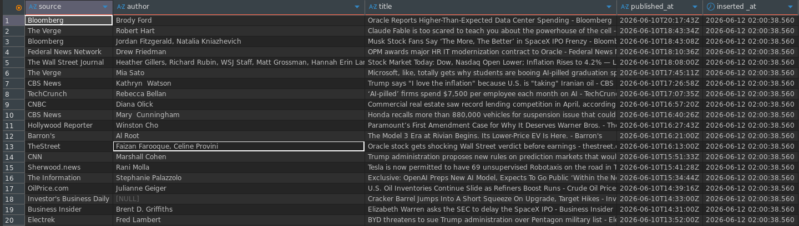

# News ETL pipeline
## Contents
1. [Project Overview](#project-overview)
2. [Tech Stack](#tech-stack)
3. [Prerequisites](#prerequisites)
4. [project Structure](#project-structure)
5. [Environment Setup](#environment-setup)
6. [Project Architecture](#project-architecture)
7. [Running the pipeline](#running-the-pipeline)

## Project Overview
The aim of this project is to collect the top business news data in the US, structure the api data extracted logically and load the data to a postgres database

## Tech Stack
- Python
- NEWS API
- Pandas
- SQLalchemy
- psycopg2
- PostgreSQL

## Prerequisites
1. A running postgres database
2. A NEWS API key

## Project Structure
```text
news_etl_pipeline
├── README.md           #Project documentation
├── config.py           # Environment settings
├── etl
│   ├── __init__.py     #package definition
│   ├── extract.py      #data extraction logic
│   ├── load.py         #database loading logic
│   ├── pipeline.py     #ETL synchronization
│   └── transform.py    #extracted data transformation logic
├── main.py             #project entrypoint
└── requirements.txt    #list of project dependencies
```

## Environment Setup
### 1. Python virtual environmnet
Create and activate a python virtual environment
```bash
#creating a python venv
$ python -m venv <your_venv_name>
#activating the venv
$ source <your_venv_path>/bin/activate
```
### 2. Project Cloning
Clone the project from github once you are your python virtual environment and switch to the project directory.
```bash
$ git clone <repository>
$ cd ~/news_etl_pipeline
```
### 3. Environment Configuration
Create a .env file and copy paste the configuration setting in the file [.env.example](.env.example). Ensure to modify the configuration values to match your environemnt.
```bash
$ touch .env
```
### 4. Dependency installation
Install the dependencies used to create the project, which are found in the [requirements.txt](requirements.txt) file.
```bash
$ pip install -r requirements.txt
```

## Project Architecture
There are 4 main modules in the project
1. extract
2. transform
3. load
4. pipeline

### Extract
The data from NEWS API is extracted based on the specified parameters. This module incorporates the use of python `requests` to get data from the REST API.

### Transform 
Once the data is extracted, it is structured coherently using python `pandas` module.
### Load
This contains the logic for uploading the cleaned data to the postgres database. `sqlalchemy` and `psycopg2` are used to connect to the database while pandas `to_sql` function is used to upload the data to the DB.

### General Architecture:
```bash
 --------
|NEWS API|
 --------
    ⬇
|-------------|    
|pipeline     |
|-------------|    
|Extract      |
|    ⬇        |
|Transform    |  
|    ⬇        |
|   Load      |  
|             |  
|-------------|
     ⬇
  --------    
 |Database|
  --------
 ```

 ## Running the Pipeline
 The [main.py](main.py) serves as the entrypoint to the project. To run the pipeline run the command below:
 ```bash
$ python -m main
```
The database then has a table as show below:

<figcaption align="center"><i>news table</i></figcaption>
